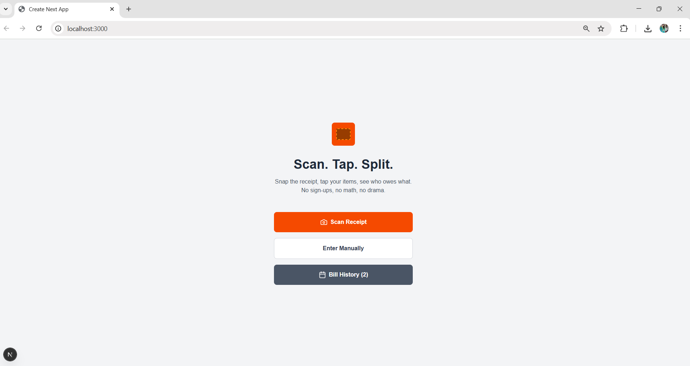
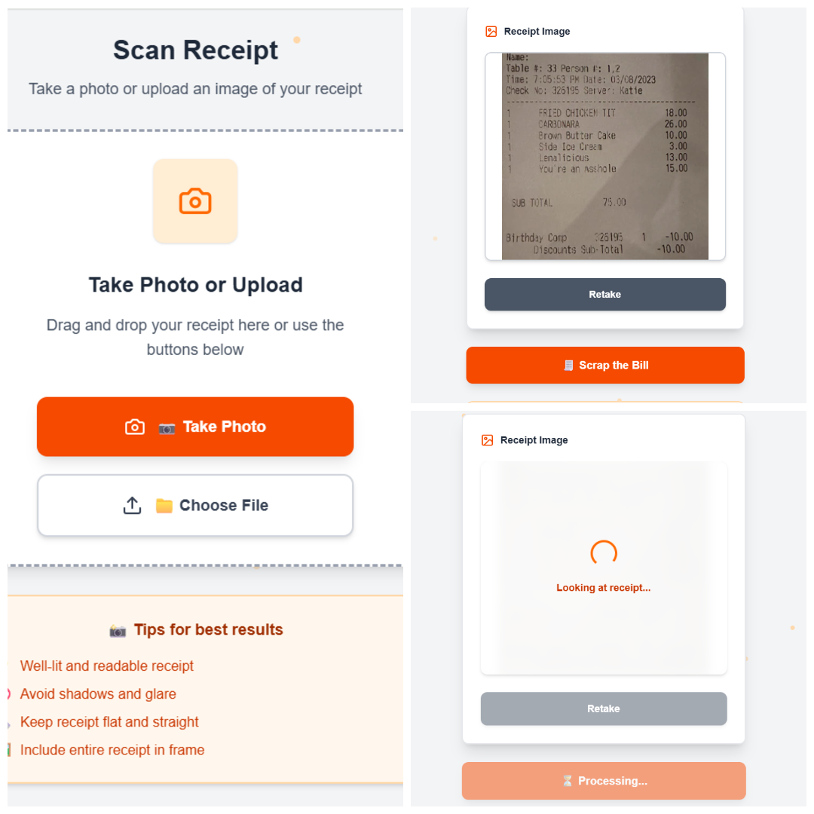
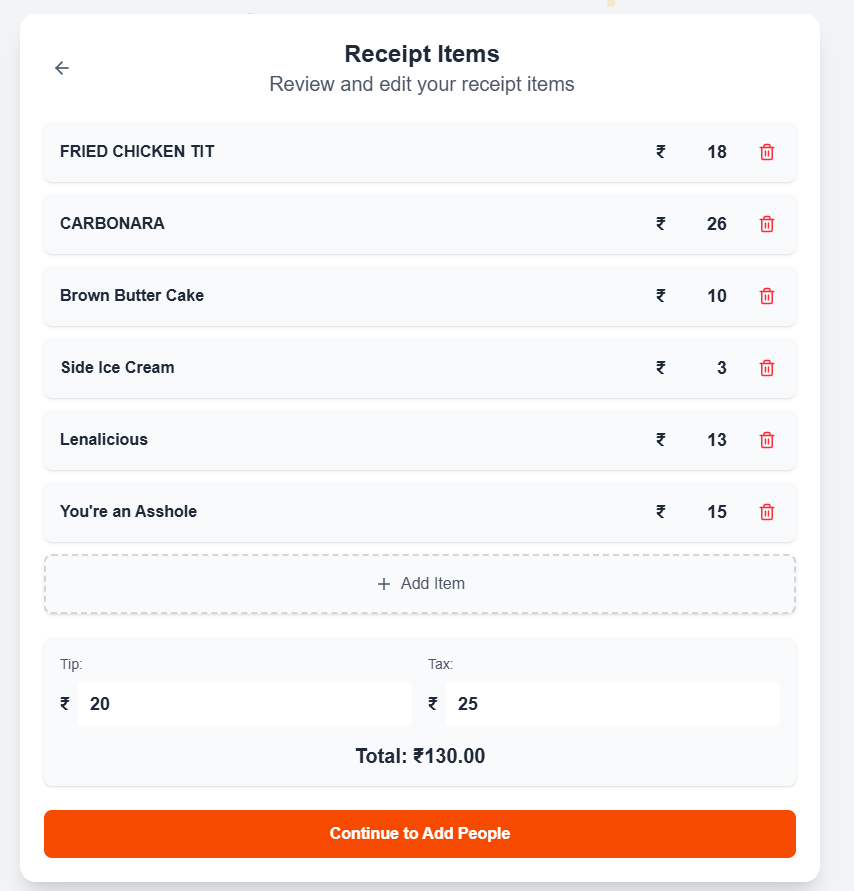
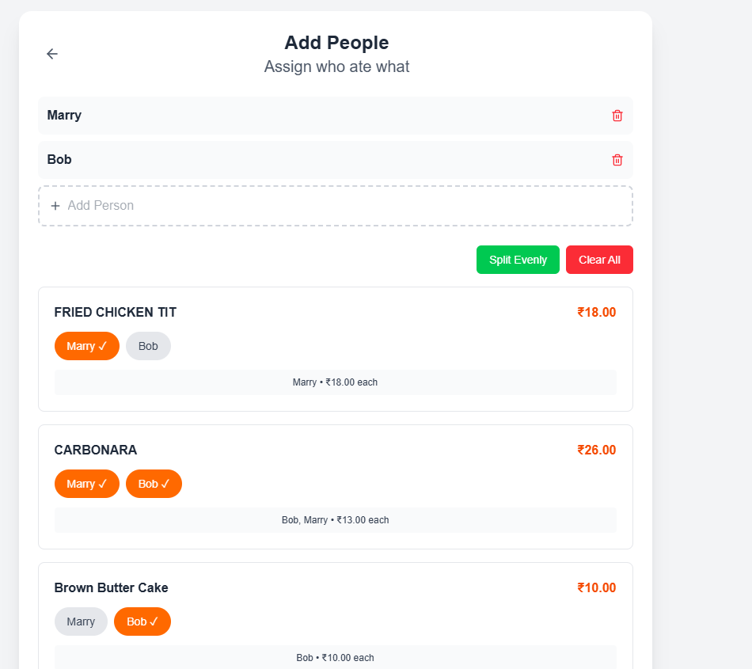
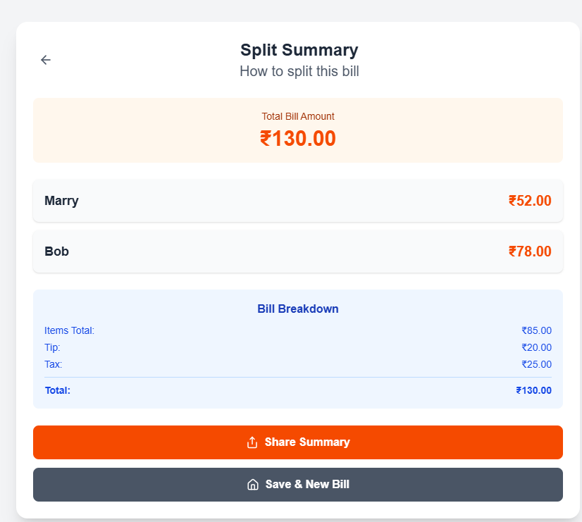
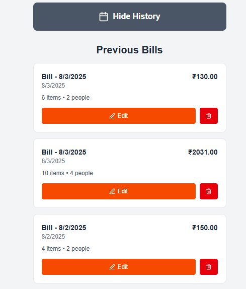

# 🧾 Bill Split App

A modern, AI-powered bill splitting application that automatically parses restaurant receipts and fairly splits bills among friends. Built with Next.js, TypeScript, and free OCR technology.


## ✨ Features

### 📸 Smart Receipt Scanning
- **Camera Integration**: Take photos directly from your device
- **Drag & Drop Upload**: Easy file upload interface
- **Free OCR**: Uses Tesseract.js for completely free text recognition
- **Real-time Progress**: Visual feedback during processing

### 🤖 Intelligent Parsing
- **Automatic Item Detection**: Extracts menu items and prices
- **Tax & Tip Recognition**: Identifies additional charges
- **Smart Text Processing**: Handles various receipt formats
- **Error Recovery**: Graceful fallback to manual entry

### 💰 Advanced Bill Splitting
- **Per-Item Assignment**: Assign specific items to individuals
- **Proportional Tax/Tip**: Distributes charges based on consumption
- **Split Evenly Option**: Quick even distribution across all people
- **Real-time Calculations**: Live updates as you make changes

### 📱 User Experience
- **Mobile-First Design**: Optimized for all devices
- **Intuitive Interface**: Clean, modern UI with smooth animations
- **Bill History**: Save and review past splits
- **Share Results**: Export split details to share with friends
- **Offline Ready**: Works without internet after initial load

## 📱 Screenshots

<div align="center">

### Main Features
<table>
  <tr>
    <td align="center">
      <br>
      <strong>🏠 Home Page</strong><br>
      <em>Start your journey</em>
    </td>
    <td align="center">
      <br>
      <strong>📸 Free OCR Scan</strong><br>
      <em>No API costs</em>
    </td>
    <td align="center">
      <br>
      <strong>🍽️ Smart Parsing</strong><br>
      <em>Auto-extract items</em>
    </td>
  </tr>
  <tr>
    <td align="center">
      <br>
      <strong>👥 Fair Assignment</strong><br>
      <em>Who ate what?</em>
    </td>
    <td align="center">
      <br>
      <strong>💰 Final Split</strong><br>
      <em>Detailed breakdown</em>
    </td>
    <td align="center">
      <br>
      <strong>📊 History</strong><br>
      <em>Track expenses</em>
    </td>
  </tr>
</table>

</div>

## 🛠️ Tech Stack

### Frontend
- **Next.js 14** - React framework with App Router
- **TypeScript** - Type-safe JavaScript development
- **Tailwind CSS** - Utility-first CSS framework
- **Zustand** - Lightweight state management
- **Lucide React** - Beautiful icon library

### OCR & Processing
- **Tesseract.js** - Free, client-side OCR engine
- **UUID** - Unique identifier generation
- **Custom Parser** - Smart receipt text interpretation

### Deployment Ready
- **Vercel** - Optimized for seamless deployment
- **Zero API Costs** - Completely free to run and deploy
- **Progressive Web App** - Installable on mobile devices

## 🚀 Quick Start

### Prerequisites
- Node.js 18+
- npm or yarn

### Installation

1. **Clone the repository**
   ```bash
   git clone https://github.com/yourusername/bill-split-app.git
   cd bill-split-app
   ```

2. **Install dependencies**
   ```bash
   npm install
   # or
   yarn install
   ```

3. **Install OCR dependency**
   ```bash
   npm install tesseract.js
   ```

4. **Run development server**
   ```bash
   npm run dev
   # or
   yarn dev
   ```

5. **Open your browser**
   Navigate to [http://localhost:3000](http://localhost:3000)

## 📁 Project Structure

```
bill-split-app/
├── src/
│   ├── app/
│   │   ├── scan/page.tsx         # Receipt scanning interface
│   │   ├── items/page.tsx        # Item review and editing
│   │   ├── people/page.tsx       # People management & assignment
│   │   ├── summary/page.tsx      # Final split calculations
│   │   └── history/page.tsx      # Bill history
│   ├── store/
│   │   ├── useSplitStore.ts      # Main app state
│   │   └── useBillHistoryStore.ts # History management
│   └── components/
│       └── ui/                   # Reusable UI components
├── public/
└── docs/
    └── screenshots/              # App screenshots
```


1. **Image Capture**: Users take photos or upload receipt images
2. **OCR Processing**: Tesseract.js extracts text from the image
3. **Smart Parsing**: Custom algorithm identifies items, prices, tax, and tips
4. **People Management**: Add and manage people involved in the bill
5. **Item Assignment**: Assign specific items to individuals
6. **Calculation**: Automatically calculate individual amounts including proportional tax/tip
7. **Results**: Display and share the final split

## 🎯 Key Features in Detail

### 🔧 Smart Receipt Parser
```typescript
// Automatically detects and extracts:
- Menu items with prices
- Tax amounts (GST, VAT, etc.)
- Service charges and tips
- Total amounts
- Handles various receipt formats
```

### 👥 Flexible People Management
- Add/remove people dynamically
- Edit names on the fly
- Visual assignment interface
- Bulk assignment options

### 💡 Intelligent Splitting
- **Per-item basis**: Each person pays only for what they ordered
- **Proportional charges**: Tax and tips distributed fairly
- **Split evenly**: Quick option for equal distribution
- **Real-time updates**: See changes instantly

## 🌟 Why This App?

### ✅ Completely Free
- **No API costs** - Uses free Tesseract.js OCR
- **No subscriptions** - Free to use forever
- **Open source** - Transparent and customizable

### ✅ Privacy Focused
- **Client-side processing** - Images never leave your device
- **No data collection** - Your receipts stay private
- **Offline capable** - Works without internet

### ✅ User Friendly
- **Intuitive design** - Easy for anyone to use
- **Mobile optimized** - Perfect for restaurant use
- **Fast performance** - Smooth and responsive


<div align="center">

**Made with ❤️ for splitting bills fairly**

⭐ **Star this repo if it helped you!** ⭐

</div>